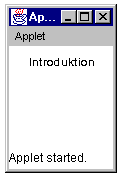
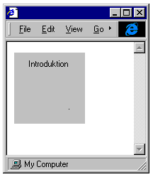
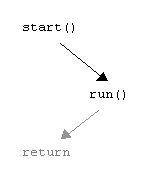
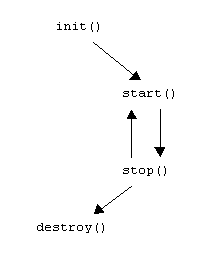

# A series of articles about Java ca 1998 published in *PC+*

**1 Introduction**

Java has grown significantly since it was publicly introduced by Sun Microsystems in 1995. Back then, the applications were mainly small applets (English applets) available on the web. Today, it can be found in everything from mobile phones to database servers.

Although Java is often referred to as a programming language, it is more closely related to a system. It has many syntactic similarities with the programming language C++ or C, and programmers familiar with C++ usually do not have difficulty learning Java. But the languages ​​are fundamentally very different. Java has many advantages over C++. Among them can be counted*the portability*. The portability allows you to drive precisely*same program* without changes on different platforms, such as Microsoft Windows, Apple MacOS or Solaris with X Windows. You can therefore follow this series regardless of whether you run Linux on a Pentium, an Apple with PowerPC, Windows 95, 98 or NT on a Pentium. In the C languages, you often have to change different calls or constants depending on the platform you are writing the program for.

Another is*the object orientation* which is clearer in Java. Java is also structured differently than C++. A C++ compiler generates directly executable code. Under Java, execution is split into two steps. A program is first compiled into a so-called*byte code*. This code is translated in a second step into executable code, or the byte code is interpreted. The last step takes place with the help of a virtual machine, JVM (Java Virtual Machine). With various techniques, the latter process can be sped up, which many hope will happen with the next generation of virtual machines, called HotSpot, which has been announced for release this winter.

This series of articles will use Java 1.1 and only on a few occasions briefly mention how the same problem was solved in the previous version 1.0. Sun Microsystems provides a free development kit that can be downloaded from the Internet: JDK (Java Development Kit). Here we will also use Sun's JDK. It is recommended that the reader use a later version that complies with Java 1.1. Latest sharp version for JDK is JDK 1.1.7. For those who want to experiment more, JDK 1.2 (currently in beta versions) is recommended. However, you must register before you can download this beta JDK.

No special development environment or class packages other than those found in the JDK are assumed in this article series. In addition to commercial development environments, there are advanced but free ones such as e.g. GNU Emacs. A very simple shareware editor, but fully useful for compiling and running Java is called TextPad. (Note that you must first install Java before the editor if you want to use the editor's built-in capabilities to run Java.) You can also write in e.g. Windows' included text editor Notepad, save, compile and run.

Here we will limit ourselves to a small part of everything that Java can do: essentially applets and the window environment*AWT* (Abstract Windows Toolkit).

***Installation***

In addition to downloading a JDK, it must be installed. All this is described in English in the compressed file. But it can be a bit tricky for those who are not so used to computer users. Here is a brief description of how to do it for Windows 95. When you have downloaded the JDK, you unpack the package. You can also download the documentation (Javadoc) and place it in the same directory as the JDK. Previous distributions use ZIP files. You can unpack these with tools found on the PC+ accompanying CD. Later distributions usually use self-extracting files (whose file names end in .exe). Depending on which computer and operating system you have, the packaging of the JDKs is different, and adapted to what is usually common on that particular type of computer and operating system.

After you have unpacked the JDK in e.g. the root of C:

```console
    C:\jdk1.1.7
```

This is how you find AUTOEXEC.BAT and edit it. Often it works fine to right-click and select edit, otherwise you can open the file with a text editor. Locate where the PATH variable is set, and add:

```console
    PATH = C:\jdk1.1.7\bin;%path%
```

Where %path% here are the paths that are already set. Otherwise, you can also just add this line to the end of the file. The next thing to change in AUTOEXEC.BAT is to set a new CLASSPATH variable (if you haven't already installed Java). CLASSPATH in this case becomes:

```console
    set CLASSPATH=C:\jdk1.1.7\lib\classes.zip;.
```

The JDKs consist mainly of two things: firstly*tool* which we use to compile and run programs, and partly packages of classes that make up the core classes or*the standard classes* in Java (core). The first variable PATH was set for Windows to find the tools (binary files). The second variable CLASSPATH was set for Java to find the default classes.

***The javac tool and appletviewer***

After installation, the computer must be restarted for Windows to be initialized by the variables that were set. If nothing has gone wrong, you can now start running Java. Open an editor or word processor capable of saving plain text, and enter the following HTML code:

```html
    <title></title>
        <applet
            code=T.class
            width=100
            height=100>
        </applet>
```

This is a slightly shortened HTML code, which is now standardized. Save the text file asT.html in a suitable directory, e.g.test in the root of C. The next file is the Java source code file. Open the editor again and enter:

```java
import java.applet.Applet;
import java.awt.Graphics;

public class T extends Applet {
	public void paint(Graphics g) {
		g.drawString("Introduction", 20, 20);
	}
}
```

It is important that the code is written*exactly* as in the example, with upper and lower case letters. Namely, Java distinguishes between uppercase and lowercase letters. Save the file as `T.java`. This Java file must be compiled first:

```console
    C:\test> javac T.java
```

At this point there are three files in the directory 'test'. Two text files `T.html` and `T.java`, as well as a bytecode file T.class which was created when the source code was compiled. If the compilation went well, we can also run the file through appletviewer. It is now that the HTML file will be used:

```console
    C:\test> appletviewer T.html
```

The result should be approximately:

If you have a web client such as Netscape Navigator or Microsoft Internet Explorer with a version that supports Java 1.1, you can also see the applet if you open the web client and choose to open the HTML file:






***T -- a first explanation***

Don't be alarmed if you don't understand this explanation. Things will clear up eventually. The explanation is included to begin with an explanation at all. The first two lines import classes from `classes.zip`. The first says that an applet class is imported, the second that a graphics class is imported:

```java
import java.applet.Applet;
import java.awt.Graphics;
```

A first block with starting staples{ and closing braces}, says that it is an applet class that is declared:

```java
public class T extends Applet {
	...
}
```

The class declaration begins with a modifier, that it is a class, the name of the class, and that it extends another classApplet. In this applet class there is a method that is also delimited by braces:

```java
public void paint(Graphics g) {
	...
}
```

The method is called `paint()` with an argument `Graphics` and a parameter `g`. The method has a modifier which is `public` and a return type that is `void` (ie empty). Inside the method there is a statement that prints a piece of text on the applet's surface, at x-direction 20 pixels from the left and in y-direction 20 pixels from the top:

```java
g.drawString("Introduction", 20, 20);
```

All this is completely incomprehensible at first, but it will become clear as we vary the content and explain through more examples.

***Within the applet viewer***

The applet viewer (or equivalent web client) is needed to run bytecode that is an extension of the applet class (java.applet.Applet). In the HTML file there is a reference to the byte code fileT.class. For the most part, the machine-specific code in the applet viewer deals with window management. Window management is fundamentally different under Microsoft Windows, Apple MacOS or X Windows. Although window management is different, Java has classes that build an abstract graphical interface that the Java programmer works with: AWT (Abstract Window Toolkit). Therefore, you never have to worry about what happens under the shell of Java. The same Java program can be used under all these operating systems without rewriting the program.

Applets work great to be transported on the Internet. Suppose your filesT.html andT.class has been placed in a directory for websites on the Internet. If you now return and start a web client on your own computer, the client first downloads a copy of the HTML file, and starts an internal applet viewer that loads the bytecode file `T.class`.

The bytecode file is verified to check that nothing has happened while it has been online. If the bytecode file is approved by the verifier, it is handed over to the class loader. The class loader controls, among other things, that the downloaded file does not act on its own in place of already loaded classes. Classes related to security.

In early implementations of Java occurs*the security manager* (SecurityManager) that audits the applet. The security manager is implemented differently depending on the applet viewer or the particular web client. For example, the applet can be prevented from saving information on the local computer it runs on. As you already know, the applet can be run locally on the computer. Even a downloaded applet can run locally, but cannot connect to places other than where it originally came from.

***New security models***

The kind of security model that appears in Java 1.1 with the security manager (SecurityManager) has been replaced by*protected domains* in Java 1.2. It is no longer just the aim that applets should be able to be transported to clients and be able to be safely run by them. Java will now also exist on the server side, calls are made over networks (RMI), encrypted messages (and objects) are sent over networks, which places higher demands on Java's security model.

In addition to the language itself being designed to deal with security-related problems, the (original) compiler also aims to track incorrect type conversions, etc. and that the Java Virtual Machine (JVM) is designed to verify the bytecode before the code is finally executed. The security is also implemented in the "just-in-time" compiler (JIT). A device that speeds up the execution of Java.

What has been added is*protected domains* (Java Protection Domains). These domains control what types of resources the executed bytecode has access to. If the code comes from the local disk, it can have greater powers and access to read and write to disks or communicate via ports to the Internet, than if it comes from the web. Also whether an applet e.g. has been signed by a credible authority is important for what rights it has to the system. Everything loaded in from Sun (www.sun.com) ends up in one domain, everything from Microsoft (www.microsoft.com) in another domain. If the applets are then given permission (by you) to save files, they can do so in separate directories.

A standard domain (default domain) with very restrictive rules is the domain where everything ends up that is not signed or does not have credible senders. The advantage of protected domains over security managers is, among other things, that the protected domains are more flexible, and do not require that the implementers of e.g. web clients (web browsers) have written a security manager. Security can be delegated to whoever administers the security of the system instead of the programmer.

***Protected domains***

The protected domains are based on each class that programs are built from. What rights they get depends on where they come from, and who signed the classes. When a program runs, the classes must reside within the domain that has all access to the resources the classes call. If not, a general error will be generated.

A class can assert its accessibility right through an accessibility control class (`AccessController`). This allows classes that would not normally have access to certain resources to gain access by being able to use classes that already have these privileges. However, the classes cannot acquire their own rights (through `AccessController`) other than they already have. But the possibility to e.g. using the signature and origin of other classes opens potential security holes. This model is more flexible than the previous one, but comes with the responsibility of being able to write very secure code.

Privileged sections of code that allow any other classes to run certain code and must be written with care. Furthermore, policy can be defined. A policy means that it is declared where classes come from, who they are signed by, what permissions they have and what they are allowed to do. A policy file allows you to more dynamically allow or restrict classes without having to rewrite the classes or be forced to download new classes (as previously with `SecurityManager` where availability was hardcoded directly into the classes).

In addition to the protected domains, there is, as before, the verifier. The verifier takes care of the code once it arrives in the virtual machine (JVM). As the security manager (SecurityManager) existed as an extension outside the virtual machine (e.g. it did not exist when independent applications were running), the protected domains have been encapsulated in *runtime*. (A runtime can be thought of as the entire environment in which Java runs. Compare with the JRE Java Runtime Environment which is a tool in the JDK.) The Java language itself is designed to be safe in several respects, as it does not have explicit pointers, scope of indexes (arrays) are checked at runtime, strings are static (except string buffers), modifiers, default values ​​are assumed if no initializations occur, etc.

***Other security***

In addition to protected domains, special packages have been added to later versions of Java (from 1.1) JAR (Java ARchives) for applets. These packets can be signed and if the sender is deemed trustworthy, the packet is executed. Thereby, applets can obtain significantly better access to the system than they otherwise get from standard assumptions (protected domains default). Signed archives should not be responsible for security alone (as is the case with ActiveX). The signing is most closely related to confirming the sender or the person who guarantees what is being sent. It thus does not prevent that there may be hostile code sections sent from a hostile sender, even if this risks prosecution. The code itself cannot be guaranteed to be free from intentional harm. Digital signatures sent in e.g. transactions between a bank and a customer, only verify the sender's identification, not what his intentions are. In the case of software, the damage may first occur, after which the sender may risk action. Such things as signing should thus be distinguished from other security such as*prevents*hostile attacks, such as protected domains.

Furthermore, there is JCE (Java Cryptography Extension) which allows cryptographic techniques for Java. Cryptography is common as a protective mechanism, but should not be the sole protection. As there are restrictive export restrictions by US law for certain encryption (as an effect of World War II threat images), only generic interfaces have been included. Within the U.S. and Canada, strong encryptions such as DES (Data Encryption Standard) can be used, and included as an implemented mechanism to Java's encryption classes and interfaces. It is also due to that Sun considers the encryptions an export barrier that PC+ cannot distribute the JDK, but you have to download it yourself.


Set Lonnert


Links:

JDKs http://java.sun.com/

TextPad http://www.textpad.com/

Emacs http://www.cs.washington.edu/homes/voelker/ntemacs.html


AUTOEXEC.BAT

|<p>…</p><p>PATH = C:\jdk1.1.7\bin;%path%</p><p>set CLASSPATH=C:\jdk1.1.7\lib\classes.zip;.</p><p></p><p></p>|
| :- |

JDK

| appletviewer |A so-called applet viewer where you can see and test run your applets.|
| :- | :- |
| java|The interpreter for Java. Can run programs written and compiled to byte code with javac.|
| javac |A compiler for Java, which from source code generates bytecode.|
|classes.zip|A compressed file containing all standard classes (\*.class filer).|


T.html

|<p></p><p><title></title></p><p><applet</p><p>`  `code=T.class</p><p>`  `width=100</p><p>`  `height=100></p><p></applet></p><p></p>|
| :- |

T.java

|<p></p><p>import java.applet.Applet;</p><p>import java.awt.Graphics;</p><p></p><p>public class T extends Applet {</p><p>`  `public void paint(Graphics g) {</p><p>`    `g.drawString("Introduction", 20, 20);</p><p>`  `}</p><p>}</p><p></p>|
| :- |

*runtime*


T.html

*compiling*

T.java

javac

T.class

appletviewer


When Sun Microsystems openly introduced the Java programming language in 1995, the applications were mainly small programs for the web: applets (English applets). Today, the language and the whole world (classes) Java lives in have grown greatly. Every day there is an advertisement in the daily press for programmers for Java. Although Java is now quite comprehensive, you can learn it like any other programming language. With all the future expected applications written in Java, it is conceivable that it will pass in popularity compiler languages ​​such as C++ or Pascal.


*Learn Java*

Even if you are not going to become a programmer, there are several reasons why learning Java can be interesting. If you do a lot with websites (or HTML on intranets), it is likely that very soon you will inevitably study Java.

You gain insight into how an object-oriented and distributed language works. It is relatively easy to learn. Because it is partially interpreted, debugging and debugging is easy to do. Using it as a language in the Internet context can be advantageous over scripting languages ​​such as Perl or compiler languages ​​such as C++, because it is robust and secure. Because several tasks can be performed simultaneously via threading, you learn the basics of parallel processing. Finally, the platform independence means that the same Java program can be run without changing a single character on both a PC with Pentium and a PowerPC with RISC.


*Basic Java and Continue with Java*

The books "Basic Java" and "Continue with Java" cover the most elementary things to start programming in Java. The introductory book "Basic Java" contains a detailed description of the language and the object orientation of Java. The follow-up "Continue with Java" takes up more advanced constructs of the language and one type of application: applets.

The books are only suitable for self-study provided you have*experience* of programming in another language. They can be used by teachers in teaching as course books or as teacher guides.

Furthermore, it is assumed that you are interested in experimenting yourself with source code examples from the Internet. You can learn for yourself the supplementary information that comes with the Sun Microsystems JDK (Java Development Kit) in the form of the API documentation and other documents. The book assumes that you are already mostly familiar with computers, how HTML is written, how files are downloaded, how programs are installed, and little else on the Internet. Other books in Know*Ware*s *Know*How series describes HTML (Hyper Text Markup* Language) and generally about the Internet.<sup>[^1]</sup>

The books cover Java in its version 1.0 (JDK 1.0.2). At the beginning of summer 1997, there is not yet more than one HotJava web browser that supports version 1.1 (JDK 1.1.\*). Neither Microsoft nor Netscape has yet launched any such browser. In its later version, Java has assumed too large proportions to be fully described in two neat volumes. However, all examples can be compiled and run without change in version 1.1 of Java. It also means that you can run your older programs in new browsers without changing the code.


*The development of Java*

Partly there is a hardware development, and partly there is a software development. The combination means that Java has no equivalent existing today. The ideas behind Java, including network connections, object orientation, platform independence, distribution, etc. means that Java will be present in many technical devices that are somehow networked. But above all for a wider public, Java will continue to be a popular software engine for the Internet. As the operating systems become more and more networked, the platform-independent Java will also gain more and more importance in the connections between the computers, between the operating systems and between the user interfaces.

Since the applications range from supercomputers to special network computers (NC), mobile phones, smart cards and web TV, we can expect Java in our Internet-connected purchase cards as well as in the bank's server that receives the transactions.

In the fall of 1997, Sun launches JavaPC, which means that an older PC with Intel's 486 or Pentium can be upgraded cheaply (less than $100) to a network computer. Today, the network computer is suitable for fast intranets at e.g. business. But it may take some time before the network computer is introduced to the slower Internet.

Sun has developed JavaBeans, a component model for Java. Partly there is an API, and partly there is a simpler development package. These components (beans) can be integrated directly with other components in e.g. Visual Basic, Visual C++, Word, Excel or Internet Explorer. With the JavaBeans Development Kit (BDK), you don't need to write a line of Java code, but can produce the code directly with visual tools. With JavaStudio, Java code can also be generated without you having to be a programmer. In the Java WorkShop, which includes JavaStudio, there are tools for developing and testing not only beans but also applets, applications and dynamic web content.


***Download & Installation***

To be able to use Java, you can purchase a CD-ROM that contains Java. But you can also download Java from the Internet. If you are installing from CD-ROM, read and follow the instructions on the CD-ROM. Sun Microsystems, which developed Java, provides the language, documentation, manuals, etc., as well as a complete development package via the Internet: JDK (Java Development Kit).

First quarter 1997, the current release is JDK 1.1 for Microsoft Windows 95 and NT. Second quarter 1997, the current release is JDK 1.1 for Apple Macintosh and PowerPC. Furthermore, JDK 1.1 may be translated (ported) to Linux and other operating systems.

In the future, the previously valid stable version JDK 1.0.2 will be followed. However, all programs and examples in this book can be run under version 1.1. However, the book does not address the news in 1.1. At the time of this writing, JDK 1.1 has just been released and there are still very few programs on the Internet that*only* can run under version 1.1.

You can basically follow the same instructions for downloading JDK 1.0.2 as you did for JDK 1.1. Select 2a or 2b below depending on which version JDK you choose. (Note that download addresses may change: first see Sun's home pages:http://java.sun.com/.)

1.	Create a directory, for example jdk-1.0.2 or jdk-1.1. (If you have multiple versions of the JDK, it's a good idea to create different directories for them, and**not** put them in the same.)
2.
	- a.	Download JDK 1.0.2 and documentation: http://java.sun.com/products/JDK/1.0.2/  or
	- b.	Download JDK 1.1 and documentation: http://java.sun.com/products/JDK/1.1/
3.	Place the files in your newly created directory.
4.	Unzip the compressed and downloaded files. (Different types of unpacking software may be needed depending on your operating system.) Pack**not** upclasses.zip.
5.	To save space, you can delete the files you originally downloaded.
6.	Set path and environment variables.

If the JDK download was successful, you only need to assign new values ​​to two variables:*the path* and*the environment variable*.

The path tells your system where the Java binaries are located, which can be executed by the system. You should therefore not delete other information in the system's search file, but only add information about the new path for Java.

The environmental variable `CLASSPATH` can mostly be specified as arguments to the commands Java has. But the easiest way is to assign the value to the variable once directly for the system. The variable indicates to the interpreter or applet viewer where Java should start searching for the pre-compiled classes you have written or which are pre-compiled in the JDK (standard classes). The variable is also used by other commands (programs). However, if you have multiple JDKs installed, you must select only*in* set of default classes ie. `CLASSPATH` may contain only one path to the default classes.

The following indication of `CLASSPATH` tells the system to first search the current directory (a dot) before searching the directory there `classes.zip` exists. Of course, you can specify more directories with the respective directory separator there\*.class exists. (The directory separator for Microsoft Windows 95 and NT is a semicolon, while Solaris has a colon.)


*JDK 1.0.2*

**Microsoft Windows NT (Intel) och 95**

Set CLASSPATH as well as edit and add path in the fileAUTOEXEC.BAT:

```console
path *previous-path*;C:\jdk-1.0.2\java\bin
set CLASSPATH=.;C:\jdk-1.0.2\java\lib\classes.zip
```

**Solaris 2.3, 2.4, 2.5, 2.5.1 for SPARC-based machines**

add to `.cshrc` file, if you are working in c-shell:

```console
set path = (*previous-path* /usr/local/jdk-1.0.2/java/bin)
setenv CLASSPATH .:/usr/local/jdk-1.0.2/java/lib/classes.zip
```

*JDK 1.1*

Sun Microsystems' development package for Java JDK 1.1, now comes partly in downloadable software, and partly in documentation. Please note that the specific download and installation instructions may change.<sup>[^2]</sup> Likewise, newer versions of the JDK may be available for download since this book went to print. If you have now succeeded in the installation, there are two directories:docs andjava.

**Microsoft Windows NT (Intel) och 95**

Set CLASSPATH as well as edit and addpath in the fileAUTOEXEC.BAT:

path *previous-path*;C:\jdk-1.1\java\bin

set CLASSPATH=.;C:\jdk-1.1\java\lib\classes.zip

**Solaris 2.3, 2.4, 2.5, 2.5.1 for SPARC-based machines**

add to.cshrc file, if you are working in c-shell:

set path = (*previous-path* /usr/local/jdk-1.1/java/bin)

setenv CLASSPATH .:/usr/local/jdk-1.1/java/lib/classes.zip


*JDK*

Java's development package contains, among other things, two files that are composed of several small:classes.zip andsrc.zip.

In addition to these composite files, there are various programs, some of which are specially made for the platform (computer and operating system) you have, for example Windows NT, Windows 95 or Solaris (Unix). The more important ones are:appletviewer, javac, java, javadoc, javap andjdb. Furthermore, there are programs (or commands) for the JDK,\*.java as well as compiled\*.class filer:

appletviewer
	`A so-called applet viewer where you can see and test run your applets.

classes.zip
	`Contains all compiled\*.class* files combined into a single one.zip in.

java
	`The interpreter for Java. Can run programs written in Java, and compiled to byte code withjavac.

javac
	`A compiler for Java, which from source code generates bytecode.

javadoc
**
`	`Generates documentation of Java programs from the source code. The documentation is automatic and forms HTML documents, which describe public (public) and protected (protected) classes, constructors, methods and fields. It also generates a list of the Application Programming Interface (API) classes, hierarchy, and index found in the API documentation.

javap
**
	`A Java bytecode disassembler, which prints a human-readable representation of the bytecode.

jdb
**
	`A "debugger" for Java. Helps you find errors (bugs) in Java programs.

src.zip
	`All source code files for\*.java which is in classes.zip. All classes documented through the included API docs are included here.

Some other programs come with JDK 1.1. But it is only when you master Java more than what this book covers, that you get use for those programs. Ready-made applets (demo) come with the JDK that you should experiment with and reuse. You can thus start a demo to see if the installation was successful. You do this by moving to the directory where they are located:

	`C:\> cd jdk-1.0.2\java\demo\TicTacToe

	`C:\> appletviewer example1.html

Respective:

	`C:\> cd jdk-1.1\java\demo\TicTacToe

	`C:\> appletviewer example1.html

If you have entered path and environment variables in the AUTOEXEC.BAT (or equivalent) you must restart your computer first.


**Step 1**

An essential news is that Sun Microsystems launched on December 4, 1998: "Java 2 Platform". This is the sharp version of Java 1.2 that they have renamed. There is a ready-made JDK to download from Sun's pages. An equally important detail is the outcome of the trial that began about a year ago. Sun then sued Microsoft Corporation for falsely claiming that their Java was generic Java. The verdict that came recently showed, among other things, a preliminary mandate that Microsoft's version of Java must conform to Sun's specifications.

In the last article about Java, something was described about the language, as well as the packages and tools that can be downloaded: JDK. This time you can try some ready-made applets (Java programs) with the source code that comes with the CD for PC+.

Last was shown how your first applet could look like. This time we continue exactly where we left off with the same applet. We will see how it can be changed by replacing parts of the source code inT.java. There is also associated HTML code for the applet:T.html. You can see listings of the original codes in Figure 1.

*Figure 1*

T.html

|<p></p><p><title></title></p><p><applet</p><p>`  `code=T.class</p><p>`  `width=400</p><p>`  `height=400></p><p></applet></p><p></p>|
| :- |

T.java

|<p></p><p>import java.applet.Applet;</p><p>import java.awt.Graphics;</p><p></p><p>public class T extends Applet {</p><p>`  `public void paint(Graphics g) {</p><p>`    `g.drawString("Introduction", 20, 20);</p><p>`  `}</p><p>}</p><p></p>|
| :- |


***Colored text***

Submit:

*import java.awt.Color;*

below the other import rates. Insert another row inT.java before the methoddrawString():

*g.setColor(Color.red);*

So you get:

import java.applet.Applet;

import java.awt.Graphics;

*import java.awt.Color;*

public class T extends Applet {

`  `public void paint(Graphics g) {

`    `*g.setColor(Color.red);*

`    `g.drawString("Introduction", 20, 20);

`  `}

}

Note that you*not* italicize your text as above in the editor you use, even if possible. The two new sentences have been italicized*only* so that you can distinguish them from the others.

Try compiling with "javac” and then run the applet in “appletviewer". It should be the text "Introduction” in red color. Previously it was probably in black. If you have a web client such as Netscape Navigator or Microsoft Internet Explorer with a version that supports Java 1.1, you can also see the applet if you open the web client and choose to open the HTML file.

***Variation on theme T***

The first import statement says that an applet class is imported, the second that a graphics class is imported. The new third says that a color class is imported.

import java.applet.Applet;

import java.awt.Graphics;

*import java.awt.Color;*

In the methodpaint() the statement that prints a piece of text on the applet's surface has been supplemented with a coloring before it is printed:

*g.setColor(Color.red);*

g.drawString("Introduction", 20, 20);

You can experiment by setting the coloring after the text. Swap the sets. Why doesn't the text turn red in this case? Because the statements within a method are executed in sequence one after the other. From top to bottom (from left to right).

The class used is namedColor and must be imported in order for Java to know what to do when calls or references to the class occur. A default color that is predefined isred (ie red). There are other predefined colors that you can see in examples on the CD (T1.java).

Another way to set color is to use a composition called RGB after the basic colors red, green and blue (T2.java). A new color (new object) is created throughnew:

*new Color(42, 120, 219)*

Do we form a complete statement that changes color in the graphic contextg and can be placed in the program, we get:

*g.setColor(new Color(42, 120, 219));*

The color red gets the value 42, the green 120 and the blue 219. The values ​​must be in the range 0 to 255. The new color is a composition of these three ingredients. Are you now replacing the old methodsetColor() with the new one, you get the entire program:

import java.applet.Applet;

import java.awt.Graphics;

import java.awt.Color;

public class T extends Applet {

`  `public void paint(Graphics g) {

`    `*g.setColor(new Color(42, 120, 219));*

`    `g.drawString("Introduction", 20, 20);

`  `}

}

Only the new sentence has been italicized here. The new printed text will be colored dark blue; it is the blue value that is the highest of the three and therefore dominates.

***Position text, choose font and degree***

By and large, the examples follow a simple structure, so just look at the source code, change some lines and test. But to be a little clearer, we take a few more examples. To place the text in an arbitrary position on the surface of the applet, two coordinates are used, usually named x and y. The coordinate x stands for horizontal and y for vertical placement. The position is counted from the upper left corner:


If you change the original statement:

g.drawString("Introduction", 20, 20);

against a new rate:

*g.drawString("Introduction", 120, 50);*

then the printed "Introduction" will end up at x-position 120 and y-position 50. The text starts to be painted based on the letter "I", its extreme left and bottom point. If you therefore choose to give other positions, the text may disappear outside the applet's surface.

Now also change the font and size (grade)

*g.setFont(new Font("TimesRoman", Font.BOLD, 30));*

g.drawString("Introduction", 120, 50);

so the text will still fit on the surface of the applet.

***Lines and rectangles***

If we start from the original first applet, you can replace the line withdrawString() with:

*g.drawLine(10, 10, 100, 100);*

So you get:

import java.applet.Applet;

import java.awt.Graphics;

public class T extends Applet {

`  `public void paint(Graphics g) {

`   `*g.drawLine(10, 10, 100, 100);*

`  `}

}

The line starts to be drawn at x-position 10, y-position 10 and ends at x-position 100, y-position 100. All these positions are absolutely specified according to the coordinate system. But for rectangles, the width and height of the rectangle are specified instead. Replace the above line with the drawLine() method, with the following:

*g.drawRect(10, 10, 100, 100);*

*g.drawRect(50, 50, 100, 100);*

then two equal squares will be formed with 50 pixels offset for one diagonally downwards.

***Start experimenting***

You can take a closer look at the above and more examples with e.g. the methodsdrawOval(), drawRect() anddrawLine() which can be found on the accompanying CD. Many learn new things by experimenting themselves, others by being shown. Among the examples are tasks tucked in. Test for yourself by replacing lines, recompiling the programs and looking through a web client or applet viewer. To make the sequence of compilation and execution easier after you have changed the source code, there are small "batch" files named "make" that you only need to double-click if you are running Microsoft Windows.

***The graphic context***

So far, the explanations have mostly described what happens inside the methodpaint(). The graphic context where i.a. the text is drawn up, appears as a so-called parameter topaint(). The class is calledGraphics and in the appletT has the parameter been namedg. To show with color in the source code which classes and parameters are related:

import java.applet.Applet;

import java.awt.Graphics;

public class T extends Applet {

`  `public void paint(Graphics g) {

`    `g.drawString("Introduction", 20, 20);

`  `}

}

When a color is set in the graphic context withsetColor() apply the new color until the context changes again. All text after e.g. a coloring in blue therefore becomes blue. If the color setting is changed to yellow, all subsequent text that is printed will be yellow, etc. This applies to other corresponding methods such assetFont(), m.fl.

Eventually in future articles the explanations will extend beyond the brackets. It will show, among other things, topaint() is only one of several possible methods. Applets are also just one possible way of making programs in Java. Another way is independent or stand-alone applications (Java applications). One difference between applets and standalone programs is that applets require an environment to run in: an applet viewer or web client. A standalone program does not need this.

***Comments***

A final comment applies precisely to comments. Often programmers need to comment their code. But in order for the compiler not to interpret the comments, something is needed that separates a comment from the code. In HTML it looks like this:

```html
<!-- enter the comment here -->
```

In Java, the equivalent delimiter is:

```java
/* here comes a comment */
```

But there is also the possibility in Java with a comment that extends from the double-score delimiter to the end of the line:

```java
// the comment falls in here
```

This double dash variant and the previous one can be found in the source code examples on the CD.

In Java, there is a third type of comments used for automating documentation. It is from these types of comments that the documentation for JDK 1.2 has been generated. For a hypothetical methodmakeMatrix() it may look like in Figure 2.

*Figure 2*

|<p></p><p>`  `/\*\*</p><p>`   `\* Creates new array</p><p>`   `\*</p><p>`   `\* @param x Size of matrix in x-order.</p><p>`   `\* @param y Size of matrix in y-direction.</p><p>`   `\*/</p><p>`  `public makeMatrix(int x, int y) {</p><p>`    `matrix = new double[x][y];</p><p>`  `}</p><p></p>|
| :- |


Set Lonnert


*Links*


Sun Microsystems Inc.
<http://java.sun.com/>


Microsoft Corporation
<http://www.microsoft.com/>


**step 2**

The previous article about Java, described the graphical context, how painted text can be colored and positioned, choosing fonts, painting lines and rectangles, comments in source code, etc. This time we concentrate on an example, and describe it in a little more detail.

***Steering***

The previous article addressed sequences of statements that appeared in the method*paint()*. (Sentences end with a semicolon.) This is particularly noticeable in the graphic context, where the colors of, for example, text are changed when they are painted one after the other:

g.setColor(Color.blue);

g.drawString("Introduction", 20, 20);

g.setColor(Color.red);

g.drawString("to Java", 20, 60);

Sequences are a type of control that belongs to the traditional way of programming. In this older type of programming, all forms of control can be reduced to three: sequence, selection and iteration. Selection takes place e.g. with*if-else*. An iteration (repetition) takes place with e.g.*while*. In the course on C++ they have described some traditional controls, such as*while* and*if-else* and the syntax is pretty much the same in Java. If you master C++, it is not too difficult to understand how the same effects are achieved in Java.

A newer form of somewhat complementary and comparable programming is object-orientation, which is available in Java and to which we will return.

***Integer variables***

The program*Mond.java* in Figure 2 (with associated HTML file in Figure 1) draws rectangles of random size and color. If you reload the page (reload or CTRL-R in Netscape/Internet Explorer), the rectangles will vary and look different each time. IN*Mond.java* there is the control*for*:

for (int i = 0; i < 10; ++i) {

`  `…

}

Here, the sentences in between have been removed to make the example clearer. The first thing declared inside the parentheses is an integer variable. A simple but complete declaration looks like this:

int i;

An integer variable is a so-called primitive data type. The integer variable contains a value that is within a certain range. You can see ranges for different primitive types in the table in Figure 3. Unlike C++, where the range is often determined by the capacity of the machine (processor), Java always has the same ranges regardless of which machine or operating system it runs on.

But a variable must be able to take on new values ​​to be useful. An assignment can look like:

i = 0;

Another assignment could of course look like:

i = 2;

The variable being assigned a value is always on the left side, and the value being assigned is to the right of the = sign. Declaration and assignment can be combined into a single statement:

int i = 0;

The above*for* could thus be declared as:

int i;

for (i = 0; i < 10; ++i) {

`  `…

}

The difference here, however, is that the scope of the variable here becomes much larger than if it is declared within*for*. Namely, it will be within the same block that the statement is in, e.g. the method*paint()*. The declaration is made within*for* becomes the scope only within the brackets that belong to it*for*.

***Loops***

Loops (or iterations) are when something needs to be repeated. The sentences between the brackets { and } will be repeated ten times in the following sentence:

for (int i = 0; i < 10; ++i) {

`  `…

}

The space where the variable*i* assigned the number 0 is only used for initialization at the beginning of the loop. After the semicolon, a test appears there*for* continues its loop of the statements within subsequent blocks { and }, as long as this condition is true. So fast*i* exceeds or equals 10 is terminated*for* and any batches after are started. Finally, there is a space after*for* after the second semicolon. Here there is an opportunity to e.g. increment the variable's content or decrement it each time the loop will continue:

for (*initialisering*; *test*; *post-test*) {

`  `…

}

A variable is increased (or incremented) by taking the value out of the variable, adding the number 1, and then storing the result back into the variable. This can be done through the allocation, assuming that*i* is an integer variable:

i = i + 1;

Incrementing or decrementing variables in this way is so common that it has been given a short form in both C++ and Java:

++i;

In the same way it is with:

i = i - 1;

Respective card form:

--i;

The condition or test can be either true or false. When the variable starts at 0, increases one step at a time until it reaches 9, the test is always true. The variable*i* is then less than 10. The test fails or the condition becomes false just as the variable is incremented so that it becomes greater than or equal to 10. The loop terminates.

***Methods***

Methods belong more to a later type of programming, namely the mentioned object-orientation. A number of subtleties can be applied in this type of programming. But here we start with the simpler, to look at how the methods look inside. So far, we have only consistently used one method*paint()*. The method here has been called by Java to plot what has been described by our statements. Previously we drew up e.g. colored text via this particular method. But it is of course possible to construct own methods that can be called. Two methods found in*Mond.java* is*paint()* and a new self-defined*rand()*:

public void paint(Graphics g) {

`  `…

}

int rand(int range) {

`  `…

}

What are called the methods' signatures are shown here. The signature consists of modifiers, return value, name, left parenthesis, any arguments, and right parenthesis. The body of the method is then between the matching braces after the signature. The modifier*public* must because Java expects this for this method. The modifier means that the method becomes visible to other classes throughout the class hierarchy that Java currently has available. The self-defined method, on the other hand, has no modifier, which makes it visible only to the package it is in. In this case, only to the so-called current package with the single class*World*.

Other things that differentiate the methods are that the method*paint()* does not return anything special. The method's return value has been declared as of type*void*, i.e. nothing. The new method returns a specific value, namely integer:*int*. The type of the return value is declared before the name of the method:

int rand(int range) {

`  `return …;

}

The method must also explicitly state which value is to be returned. This is done through the statement:

return (int) (Math.random() \* range);

Here, a random number retrieved through a so-called class method*Math.random()* with a given value that is passed when the method is called*range*. But then the number that is generated randomly (floating number between 0 and 1) becomes of the type*double*, the result of the multiplication must be converted to integer before it is returned. This is done by the type to which it is typecast*int* are put in parentheses*(int)*. The single sentence could also be replaced with the following sentences with the same effect:

double u;

u = Math.random() \* range;

return (int) u;

The method*rand()* will thus take an integer value that comes in and return a random value between 0 and the number that came in (specified in*range*). (One can notice here that parameters like*g* i *paint()* or*range* i *rand()* function much like variables in the rest of the methods.)

Calls to the new method can be illustrated with the following:

public void paint(Graphics g) {

`  `…

`  `int p = rand(25);

`  `…

}

int rand(int range) {

`  `…

}

Here comes the integer variable*p* to get a random value between 0 and 25.

***Link the program***

There are still some ingredients left in it*Mond.java*. The production of random colors looks schematically as follows:

public void paint(Graphics g) {

`  `Color rect;

`  `…

`    `rect = new Color(rand(255),

`      `row(255), row(255));

`    `g.setColor(rect);

`  `…

}

int rand(int range) {

`  `…

}

A variable*rect* declared as of type*Color*. This is a non-primitive data type, a so-called reference type. By randomly getting new colors via*rand()*, comes*rect* to contain randomly varied colors. These are put in the graphic context through*g.setColor(rect)*. From the applet is downloaded at the beginning of*paint()* how big it is by the method*getSize()*. The method*getSize()* returns the reference type*Dimension*. Ur *Dimension* can you pick the height*height* respective width*width* on the applet.

Dimension d = getSize();

int h = d.height;

int w = d.width;

Men *height* respective*width* are not methods, but what are called instance variables. If they were methods, it would rather look like this (which is wrong!):

int h = d.height();

int w = d.width();

An instance variable (a field) is declared outside the methods but inside the class. This is how the instance variable would*height* placed in a fictional class:

class D {

`  `int height;

`  `int getTwo() {

`    `return height \* 2;

`  `}

}

Now only a few unexplained sentences remain towards the end:

int x, y, x1, y1;

x = rand(h);

y = rand(w);

x1 = rand(h - x);

y1 = rand(w - y);

g.fillRect(x, y, x1, y1);

The integer variables*x* and*and* will get random values ​​between 0 and the width and height of the applet respectively. The integer variable*x1* gets random value between width minus the new value between 0 and width. The equivalent is given for*y1* and the height. Different sized rectangles with different colors will thus be generated when all are repeated ten times.


Set Lonnert


*Figure 1*

Mond.html

|<p></p><p><title>Mond</title></p><p><applet</p><p>`  `code=Mond.class</p><p>`  `height=300</p><p>`  `width=300></p><p></applet></p>|
| :- |


*Figure 2*

Mond.java

|<p></p><p>// Mond.java</p><p>import java.applet.Applet;</p><p>import java.awt.Graphics;</p><p>import java.awt.Color;</p><p>import java.awt.Dimension;</p><p>import java.awt.Font;</p><p></p><p>public class Mond extends Applet {</p><p>`  `public void paint(Graphics g) {</p><p>`    `Dimension d = getSize();</p><p>`    `int h = d.height;</p><p>`    `int w = d.width;</p><p>`    `Color rect;</p><p>`    `for (int i = 0; i < 10; ++i) {</p><p>`      `rect = new Color(rand(255),</p><p>`        `row(255), row(255));</p><p>`      `g.setColor(rect);</p><p>`      `int x, y, x1, y1;</p><p>`      `x = rand(h);</p><p>`      `y = rand(w);</p><p>`      `x1 = rand(h - x);</p><p>`      `y1 = rand(w - y);</p><p>`      `g.fillRect(x, y, x1, y1);</p><p>`    `}</p><p>`  `}</p><p>`  `int rand(int range) {</p><p>`    `return (int)</p><p>`      `(Math.random() \* range);</p><p>`  `}</p><p>}</p><p></p>|
| :- |


*Figure 3*

Primitive data types

|*Data type*|*Content*|*Minimum*|*Maximum*|
| :- | :- | :- | :- |
|boolean|1 bit true orfalse|(no number)|(no number)|
|byte|8-bit integer +/-|-128|127|
|short|16-bit integer +/-|-32768|32767|
|int|32-bit integer +/-|-2147483648|2147483647|
|long|64-bit integer +/-|-9223372036854775808|9223372036854775807|
|float|32-bit floating point IEEE 754|±3.40282347E+38|±1.40239846E-45|
|double|64-bit floating point IEEE 754|±1.79769313486231570E+308|±4.94065645841246544E-324|
|char|16-bit Unicode|\u0000|\uFFFF|


**Step 3**

The previous article in this series was about controls of various kinds (such as loops), but also variables and methods. This time we cover how to load images and text via HTML into applets. Also, how to use some simple components of the AWT (Abstract Window Toolkit) such as buttons and text fields.

As before, source code for the article is available on the accompanying CD for PC+.

***Load images***

Downloading images to applets is relatively easy. This is, of course, because Java is partly prepared (designed) for the Internet. Here an example*LoadImage* (see picture 1):

import java.applet.Applet;

import java.awt.\*;

public class LoadImage

`    `extends Applet {

`  `Image im;

`  `public void init() {

`    `im = getImage(

`      `getCodeBase(),

`        `"turtle1.gif");

`  `}

`  `public void paint(Graphics g) {

`    `g.drawImage(im, 10, 10, this);

`  `}

}

Instance of a class*Image* used to s.a.s. store the acquired image. The collection itself takes place through a method*getImage()*. The first argument to the method specifies where the image should be retrieved from. Since applets can only communicate with the place they came from, so does the determination*getCodeBase()* which refers to that particular place. If you know exactly where to place your applet, you can also write a URL to the applet. But the method*getCodeBase()* making it redundant to change the URL every time the applet is moved. Here, the image is downloaded locally on the computer, but as you know, applets can be used on the Internet, so you can place the image*turtle1.gif*, the HTML file*LoadImage.html* as well as the bytecode file*LoadImage.class* in a library where you have your website.

When the image is drawn, a method is specified*drawImage()*. Here, arguments are included to a variable that holds a reference to the image, the position in x-direction and y-direction where the image starts to be drawn counted from the top left corner, respectively a reference to what will be a so-called image viewer (*imageobserver*). In this case, the instance (this) of the applet that is running will be the referent, the observer. In principle, it is the case that you would use e.g. an animated GIF, the applet needs to know when the images are updated. They must receive notifications about the update, because it is on the applet that the images are drawn. That is why you specify that the person who should receive the notifications is the applet itself. Otherwise, the applet would ignore drawing itself at certain intervals, and the image would therefore not be animated (GIF).

***Parameters***

Many times it may be unnecessary to rewrite applets just to load new images (hardcoded). Then it is smarter to use parameters that are sent via HTML where you only specify in text which image is to be loaded. Here's how to specify parameters in HTML:

```html
<applet
`  `code=AppletExample.class
`  `height=300
`  `width=300>

<param
`  `name=image
`  `value=turtle1.gif>
</applet>
```

There is a name (name) and a value (value) for each parameter. Here it is an image listed as a type*image* for the applet. It would work just as well with e.g. "picture" instead, even though it is perhaps preferable to use English throughout as there is no support for Swedish diacritical marks in this context. Each name has a value, and here the value is the name of the image*turtle1*. The new thing is just to load the name of the image, and then load the image.

String s =

`  `getParameter("image");

The string*s* will thus here get the value*turtle1.gif*.

***From numbers to numbers***

Text is therefore easy to transfer from HTML to applets, for an image you enter the name, but it is a little more difficult with numbers. If it's just integers, you can let Java figure out what number it is by translating from text (numbers) to value (numbers):

String s;

int i;

s = getParameter("number");

try {

`  `i = Integer.parseInt(s);

} catch (NumberFormatException e) {

`  `i = 0;

}

If Java does not succeed in the translation, an error will be generated. This error is called*NumberFormatException*. Java requires that this be caught, even if you then choose not to do anything about the error. Here the possible error is caught:*try* (try) translate from text to speech and if errors occur*catch* (catch) and do something about it. If the translation fails, the integer variable is assigned*i* the value 0, otherwise it gets the number being translated.

The class method*Integer.parseInt()* do the translation itself. A class method is the same as a method that has been defined with*static* as a modifier in its signature. But the method is not called via an instance of the class, but by specifying the class name directly and the method name afterwards.

***Status councils***

A status bar is found in the applet viewer and usually in web clients such as Netscape Navigator or Microsoft Internet Explorer. To access this from within the applet, you can type:

getAppletContext().

`  `showStatus("Lite text.");

This status line will be used for some examples later.

***Claims and Terms***

Many times controls are used such as: provided that, do so, otherwise do so. To control conditions, statements are either true or false. The statement that 7 is greater than 3, gets the boolean variable*b* the value*true*:

boolean b = (7 > 3);

To get some point out of this, you can let the statement rule*if-else* clauses. Here is an example where it controls what happens, the string variable becomes either "yes" or "no":

String s;

boolean b;

b = (7 > 3);

if (b) {

`  `s = "me";

} else {

`  `s = "no";

}

Since 7 is greater than 3, the string variable becomes "yes". If statements are varied with variables unknown at the time of execution, will thus*if-else* to switch to what is happening.

***Buttons and text fields***

A button is a very common component in graphical interfaces such as Microsoft Windows or MacOS. In Java, they first chose to implement buttons and similar components much like the web clients do in forms. That is a button will look different on a Macintosh than it does on a PC. This technique (peer) is a bit problematic for those who want to do more advanced design. The buttons will, among other things, to be different sizes. In Java 2, however, Sun has added a graphical interface (Swing) which allows significantly more custom design, and which can also be independent (the same) of which computer the applet is running on.

But a classic Java button can be made like this:

Button b1 =

`  `new Button("Knapp 1");

But the button must also be posted on the applet:

add(b1);

A text field becomes just as easy:

TextField t1 =

`  `new TextField("Name", 20);

add(t1);

In components such as labels*Label* and text fields*TextField* you can change text through the method*setText()*. A variety of other methods also exist to manage the components (see the Java documentation).

There are many other components that are treated in a similar way. (A later article covers examples of how to easily place the components on the applet.)

***Event handler***

An event is e.g. when a user clicks a button. Or it's when someone clicks and drags down options in a menu. Then event objects (events) are generated that can be captured and processed. Event handlers handle these events. In Java 1.0, a different type of handler was used than what has been introduced later. This earlier variant has been taken out of use (deprecated). Therefore, if you compile source code with the older type of handler, the compiler will inform you that it is deprecated (recompile with "-deprecation").

Since the previous variant of event handler has been deprecated, it will not be covered here. If you want to compare the different types of handlers, you can look at the source code that comes with PC+, where both types are exemplified.

Buttons and other components thus generate events. There are a variety of ways to make component listeners. One way to listen to a button for any events is to create an event listener that only exists for this button and register it for that particular button. First the button, and the registration of an instance of a class that listens:

Button b1 = new Button("Knapp 1"),

b1.addActionListener(new B1());

add(b1);

Attached to the button is this dedicated listener with the method*addActionListener()*. A class is created that implements only one method*actionPerformed()*:

class B1

implements ActionListener {

`  `public void

`  `actionPerformed(ActionEvent e) {

`    `// here when the button is pressed

`  `}

}

If you want to access instance variables and other things in the applet to do something in the method*actionPerformed()*, then it is appropriate to add this class as an inner class.

You can see the result of a combined applet with buttons and labels in picture 2 (the source code ButtonsAndActions2.java is on the CD).


Set Lonnert


*Image 1*

![ref1]

*picture 2*


**Step 4**

The article last time covered how to load images and text via HTML into applets. Even simple components of the AWT (Abstract Window Toolkit) such as buttons and text fields were shown.

This time we cover a variant of how you can write listeners for an applet. Components, which have been previously described, can be laid out in containers (containers) using layout managers. An extended container type is applets. Some examples of layout managers are*BorderLayout*, *FlowLayout* and*GridLayout*. This time there is also a first introduction to Java's handling of objects. As before, source code for this article is available on the included CD for PC+.

***Rita med musmarkören***

And applet*Scribble* shows how you can use event listeners, and implement the methods directly in the applet; see picture 1 where it is run through the included program*Edit*. When the applet is running, you can draw directly on the surface by clicking the mouse button and dragging the mouse. Then the mouse cursor will draw a line. The code for*Scribble* found in list 1.

So we need some way to detect (listen to) when the mouse moves over the applet, when you click on the surface and drag with the cursor. One way is to add special listeners to the applet itself (which becomes this object, i.e.*this*). Add therefore*addMouseListener()* and*addMouseMotionListener()*, with the argument*this*.

public class Scribble

`  `extends Applet

`    `… {

`  `public void init() {

`    `addMouseMotionListener(this);

`    `addMouseListener(this);

`  `}

`  `…

}

***Mouse listener implementation***

The applet, which will be responsible for event handling when the mouse moves over the applet, must not only declare that it implements but also actually implement the interfaces*MouseMotionListener* and*MouseListener*. The declaration makes it first:

public class Scribble

`  `extends Applet

`    `implements MouseMotionListener,

`      `MouseListener {

`  `…

}

This time, all the methods that are defined in the interfaces (interface) must*MouseListener* and*MouseMotionListener* is implemented. The methods that must be implemented (or at least declared because interface declarations require this) are:

public class Scribble

`  `extends Applet

`    `implements MouseMotionListener,

`      `MouseListener {

`  `public void mousePressed(MouseEvent e) { }

`  `public void mouseDragged(MouseEvent e) { }

`  `public void mouseMoved(MouseEvent e) { }

`  `public void mouseClicked(MouseEvent e) { }

`  `public void mouseReleased(MouseEvent e) { }

`  `public void mouseEntered(MouseEvent e) { }

`  `public void mouseExited(MouseEvent e) { }

}

But really we only need two methods this time*mousePressed()* and*mouseDragged()*. We can continue to leave the other methods empty.

***Graphical context again***

Two instance variables*x* and*and* remembers where the mouse cursor has been before. When the mouse is clicked and the button is held down, it is called*mousePressed()*. In the mouse event object*MouseEvent* is found where on the applet the event occurred in x-direction and y-direction. These are retrieved with the methods*getX()* respective*getY()*.

When the user drags the mouse and thus the cursor, is called*mouseDragged()*. This time we use a variable of the type*Graphics* to keep track of the graphical context. This is a little different from before.

To briefly repeat, in previous articles we have let the applet itself decide when something should be drawn. The method is used there*paint()* with the argument*Graphics* *g* where the parameter (often called*g*) is of type*Graphics*. Then methods are used that can manipulate the graphical context represented via*g*.

public class T extends Applet {

`  `public void paint(Graphics g) {

`    `g.drawRect(10, 10, 100, 100);

`  `}

}

But this time we retrieve the graphic context from the applet itself*getGraphics()*. When the user drags the cursor, we get new coordinates that are put temporarily in two variables*nx* and*the*. The coordinates that were stored in the instance variables*x* and*and*, is the starting point of a line drawn to the new coordinates that we get when the cursor is dragged. Thus, a line is drawn where the cursor is drawn over the surface of the applet.

public class Scribble extends Applet … {

`  `int x, y;

`  `public void mousePressed(MouseEvent e) {

`    `x = e.getX();

`    `y = e.getY();

`  `}

`  `public void mouseDragged(MouseEvent e) {

`    `Graphics g = getGraphics();

`    `int nx = e.getX();

`    `int ny = e.getY();

`    `g.drawLine(x, y, nx, ny);

`    `x = nx;

`    `y = the;

`  `}

…

}

***Layout***

Previously in articles we have shown components such as buttons and text fields. Of course, you can do a lot of things with these. But one thing is to place the components using ready-made layout models. A model that is also used as a standard for components in the package*java.awt* is*FlowLayout*. Picture 2 shows how e.g. a series of buttons are laid out according to this model. Do you change the size of the applet's surface by e.g. when run through*appletviewer*, the components will adjust according to the size of the surface. The layout is set for the applet with the method*setLayout()*. A new object is created with*new*.

setLayout(new FlowLayout());

Another model is*GridLayout* and a third*BorderLayout*. Look through the source code and test run the applets to see how the layout models work in practice.

***Java and objects***

Actually, we've already used a lot of parts of Java that have to do with objects, and the fact that Java is an object-oriented language. The above applet*Scribble* extends*java.applet.Applet*. Men *java.applet.Applet* in turn expands*java.awt.Panel* (see picture 3). Java has a simple and straightforward hierarchy. This means that each subclass (child) has only one superclass (parent). However, each superclass can have more subclasses. Thus, there can be multiple classes that extend*java.applet.Applet*-classes. Men t.ex.*Scribble* cannot extend more than one class. However, this can be circumvented by implementing interfaces such as*java.awt.event.MouseListener* and*java.awt.event.MotionMouseListener*. An illustration of the implementation can be seen in Figure 4. At the top of the hierarchy of classes is the class*java.lang.Object*.

The concept of extending classes is among the more elementary. The advantage is that methods and fields found in the classes that are extended (*java.applet.Applet*), can be used in the class that extends (*Scribble*) without declaring these. This phenomenon is called inheritance.

From classes one can create objects (object instances); see picture 5. The creation takes place with*new*. Thus, we can create multiple objects via the same class, and assign variables that keep track of the references.

Color first = new Color(12, 34, 56);

Color second = new Color(98, 76, 54);

In this case, there will be several different color objects that we can use on different occasions to e.g. paint texts in varying colors.

***Exceeding and implementation***

Method overriding is way to control what happens inside the classes. When we've constructed applets, we've used method overriding. A method*paint()* is defined in*java.applet.Applet*. Basically every time an applet needs to be redrawn, this method is called. With the extension of the class*Applet* to*T* as above, and own definition of the method*paint()*, the class is overridden*Applet*:'s own definition. It is the own definition that will be used instead. The method s.a.s. shaded. In the case of*Scribble* shaded instead*heat()* (see picture 6).

For an illustration of both method overriding and interface implementation, see Figure 4 again. An interface is simply just empty methods that have been defined which then have to be implemented, e.g.

interface MouseMotionListener {

`  `void mouseDragged(MouseEvent e);

`  `…

}

Since Scribble has been registered as a mouse motion listener, Java expects that certain methods have been implemented, i.e. exactly those defined in the interface.

***java-editor***

This time, an application in Java is included that you can use to re-edit the source code for applets and test them (see picture 1). However, note that the program is intended for demonstration and currently in beta stage. It may therefore contain serious errors. Another problem is that the editor requires some speed from the computer.

All applets can of course still be run, and if you use any version of Microsoft Windows, just double-click on the batch files.


Set Lonnert


*List 1*

|<p></p><p>// Scribble.java</p><p></p><p>import java.applet.Applet;</p><p>import java.awt.\*;</p><p>import java.awt.event.\*;</p><p></p><p>public class Scribble extends Applet</p><p>`    `implements MouseMotionListener,</p><p>`      `MouseListener {</p><p>`  `int x, y;</p><p>`  `public void init() {</p><p>`    `addMouseMotionListener(this);</p><p>`    `addMouseListener(this);</p><p>`  `}</p><p>`  `public void mousePressed(MouseEvent e) {</p><p>`    `x = e.getX();</p><p>`    `y = e.getY();</p><p>`  `}</p><p>`  `public void mouseDragged(MouseEvent e) {</p><p>`    `Graphics g = getGraphics();</p><p>`    `int nx = e.getX();</p><p>`    `int ny = e.getY();</p><p>`    `g.drawLine(x, y, nx, ny);</p><p>`    `x = nx;</p><p>`    `y = the;</p><p>`  `}</p><p>`  `public void mouseMoved(MouseEvent e) { }</p><p>`  `public void mouseClicked(MouseEvent e) { }</p><p>`  `public void mouseReleased(MouseEvent e) { }</p><p>`  `public void mouseEntered(MouseEvent e) { }</p><p>`  `public void mouseExited(MouseEvent e) { }</p><p>}</p><p></p>|
| :- |


**Step 5**

In previous sections, we covered how to write programs where you can draw on the applet's surface with the mouse cursor, but also how to layout components (buttons, fields, etc.). In this last planned article will*animations* to be taken up. These are not done here through GIF animations (several images are placed as animations inside a GIF), but by drawing up a sequence of images (in GIF or JPEG) and repeating this -- which is basically the same effect. As before, source code is available on the accompanying CD for PC+.

***Load image***

To briefly repeat, you download an image to an applet in the following way:

import java.applet.\*;

import java.awt.\*;

public class PictureApplet

`    `extends Applet {

`  `static Image im;

`  `public void init() {

`    `im = getImage(

`      `getDocumentBase(),

`        `"Turtle.jpg");

`  `}

`  `public void paint(Graphics g) {

`    `g.drawImage(im, 0, 0, this);

`  `}

}

***Indexed variables***

If we want to retrieve more images, it can be good to put them in an indexed variable (array). Indexed variables are declared with square brackets after the name, type:

Image im[];

In this case, 3 frames will be taken in, causing the indexed variable to be constructed with (reminiscent of how objects are constructed):

im = new Image[3];

To point to and use the respective three spaces created to hold image references, one only needs to specify their respective names with a complementary integer:

im[0] = getImage(getDocumentBase(), "Turtle0.gif");

im[1] = getImage(getDocumentBase(), "Turtle1.gif");

im[2] = getImage(getDocumentBase(), "Turtle2.gif");

But now to be a bit smarter, the integers are generalized to a new variable, and the constant that there are three images is replaced with an instance variable*numImages*. The acquisition of images is now instead:

for (int i = 0; i < numImages; ++i) {

`  `im[i] = getImage(getDocumentBase(),

`    `"Turtle" + i + ".gif");

}

The framework for the animation thus becomes:

public class AnimateApplet extends Applet

`    `… {

`  `static Image im[];

`  `static int numImages = 3;

…

`  `public void init() {

`    `im = new Image[numImages];

`    `for (int i = 0; i < numImages; ++i) {

`      `im[i] = getImage(getDocumentBase(),

`        `"Turtle" + i + ".gif");

`    `}

`  `}

…

`  `public void paint(Graphics g) {

`    `g.drawImage(im[counter], 0, 0, this);

`  `}

}

The variable*counter* will increment from 0 to 2 and then reset to start its count over. But this requires a bit of extra programming where we use a thread.

***Threads***

Threading is a way to keep multiple things running at the same time. It can get quite complex and tricky when it comes to several threads and tasks that must be controlled at the same time. But thread objects are easy to create in Java:

Thread animator = new Thread(this);

With the indication of*this* (this object) Java assumes that in the class the declaration has been given, exists through the interface*Runnable* implemented a method*run()*:

public class AnimateApplet extends Applet

`    `implements Runnable {

…

`  `public void run() {

…

`  `}

}

To start a thread there is the method*start()*. To end a thread, you should just set the thread object to*null*. Previously, textbook examples incorrectly stated (and still do) that threads can be stopped using the method*stop()*. But these are what are called thread-unsafe methods and*not recommended*. (The thread is interrupted and no post-processing takes place, which may result in files not being closed correctly, if file processing is used, etc.) (See image 1.)

***Applet Lifecycle***

The method*heat()* used in applets when you want to initiate certain things, e.g. upload images. The method*paint()* was used to draw or paint something on the applet. An applet lifecycle means that when the applet is downloaded by a web client,*heat()* to be called first. Next comes a method*start()* to be called -- nothing special happens if it is not declared. If the user e.g. opens a window that overlays the web client's window, the method is called*stop()* in the applet. An unlimited number of calls can be made successively*stop()* and*start()* respective. Finally, the user may decide to terminate the web client and method*destroy()* is called. The life cycle can be seen in picture 2.

The two methods*start()* and*stop()* are excellent for our task: to start the animation and stop it. Because the animation is in a thread (the method*run()*), then it is the thread that should be started and stopped:

public void start() {

`  `if (animator == null) {

`    `animator = new Thread(this);

`    `animator.start();

`  `}

}

public void stop() {

`  `if ((animator != null)

`      `&& (animator.isAlive())) {

`    `animator = null;

`  `}

}

These statements mean that a thread is created when the applet starts, and that the thread is started. When the applet is stopped, the thread object will be*null* and the thread stops. (The method*isAlive()* for the thread object tests if the thread is still alive. The sign*&&* is a logical test that is true only if both arguments are true. In this case: if both the thread object is alive and if it is not*null*, then the object will be stopped, i.e. be added to*null*.)

***Animation***

The animation is in the method*run()*. While the thread object is not*null*, i.e. applet has not stopped, then a loop will enumerate a variable*counter* from 0 to 2 and then start over from 0. But to slow down the animation, we let the thread object sleep for a while (200 milliseconds) with the method*sleep()*, between each enumeration. The method*sleep()* requires one*try* and*catch* as prisoners*InterrupedException* To request redraw of the applet is not called*paint()* directly, but is passed to a method*repaint()* which does not need to know the graphical context (which*paint()* require):

public void run() {

`  `while (animator != null) {

`    `try {

`      `animator.sleep(200);

`      `repaint();

`      `++counter;

`      `if (counter == numImages) {

`        `counter = 0;

`      `}

`    `} catch (InterruptedException e) { }

`  `}

}

public void paint(Graphics g) {

`  `g.drawImage(im[counter], 0, 0, this);

}

Now we have completed the second part of the animated applet. If we add the parts described so far, we get the applet in list 1.

***Media manager***

There are of course many possibilities to extend the features of the applet. One of these is to improve the handling of large images over the Internet when you have slow connections. The animation otherwise has time to start before the images have had time to download. Then can*MediaTracker* be used:

public void init() {

`  `MediaTracker mt =

`    `new MediaTracker(this);

`  `im = new Image[numImages];

`  `for (int i = 0; i < numImages; ++i) {

`    `im[i] = getImage(getDocumentBase(),

`      `"Turtle" + i + ".gif");

`    `mt.addImage(im[i], i);

`  `}

`  `try {

`    `mt.waitForAll();

`    `if (mt.isErrorAny()) {

`      `getAppletContext()

.showStatus("Error loading");

`    `}

`  `} catch (Exception e) { }

}

Here, the work of downloading large or many images is left to an object instance of*MediaTracker*. The images are added*addImage()*, and then wait until the images have been loaded properly*waitForAll()*. If something goes wrong, e.g. that the images are not in place, an error will be reported.

***In handling***

The mouse button can be used e.g. to start and stop the animation. You can then add a boolean instance variable*threadSuspended* which keeps track of whether the applet is started or stopped. A switch where the variable switches the value becomes*true* if it was*false* before or*false* if it was*true* before:

threadSuspended = !threadSuspended;

That is, the animation starts if it was stopped and vice versa. The logical particle*!* (not, not) handles the switching. In this case, I have chosen to make an adapter for the mouse handling. The adapter handles the starting and stopping, depending on whether the applet is already started or not:

boolean threadSuspended;

```java
public void init() {
    …
`  `addMouseListener(
`    `new MouseAdapter() {
`      `public void mousePressed(MouseEvent e) {
`        `if (threadSuspended)
`          `start();
`        `else
`          `stop();
`        `threadSuspended = !threadSuspended;
`      `}
`    `});
}
```

***Double buff ring***

As you probably notice, the animation blinks a bit. This is because between drawing up the images, the image is turned off. This problem can be overcome with double buffering. You then store images and possibly other things to be drawn, in a special buffer: an "off screen" buffer outside the screen. Before Java 2 (1.2), however, you had to write your own buffer if you wanted a flicker-free animation.

Because that's the method*update()* that extinguishes the image, one can override this method, and thus replace the extinction with one's own drawing.

Graphics offScreen;

Image imag;

public void update(Graphics g) {

`  `if (imag == null) {

`    `imag = createImage(

`      `getSize().width, getSize().height);

`    `offScreen = imag.getGraphics();

`    `offScreen.setColor(getBackground());

`  `}

`  `offScreen.fillRect(

`    `0, 0, getSize().width, getSize().height);

`  `offScreen.drawImage(im[counter], 0, 0, this);

`  `g.drawImage(imag, 0, 0, this);

}

What basically happens is that an image is created with the same size as the applet and the graphic context from the new image is retrieved. Once the image object has been created, the buffer with the new graphic context can be extinguished with e.g. the method*fillRect()* without color specified (same effect as*clearRect()*). A new image is drawn in the new graphics context, and the image that has the graphics context can be drawn in the applet's current graphics context. The fact that the image is transferred in this way means that the graphic context is not disturbed time and time again when new objects are drawn. There is therefore less flicker.


Set Lonnert


*List 1*

|<p>import java.awt.\*;</p><p>import java.applet.\*;</p><p></p><p></p><p>public class AnimateApplet extends Applet</p><p>`    `implements Runnable {</p><p></p><p>`  `static Image im[];</p><p>`  `static int numImages = 3;</p><p>`  `static int counter = 0;</p><p>`  `Thread animator;</p><p></p><p>`  `public void init() {</p><p>`    `im = new Image[numImages];</p><p>`    `for (int i = 0; i < numImages; ++i) {</p><p>`      `im[i] = getImage(getDocumentBase(),</p><p>`        `"Turtle" + i + ".gif");</p><p>`    `}</p><p>`  `}</p><p>`  `public void start() {</p><p>`    `if (animator == null) {</p><p>`      `animator = new Thread(this);</p><p>`      `animator.start();</p><p>`    `}</p><p>`  `}</p><p>`  `public void stop() {</p><p>`    `if ((animator != null)</p><p>`        `&& (animator.isAlive())) {</p><p>`      `animator = null;</p><p>`    `}</p><p>`  `}</p><p>`  `public void run() {</p><p>`    `while (animator != null) {</p><p>`      `try {</p><p>`        `animator.sleep(200);</p><p>`        `repaint();</p><p>`        `++counter;</p><p>`        `if (counter == numImages) {</p><p>`          `counter = 0;</p><p>`        `}</p><p>`      `} catch (InterruptedException e) { }</p><p>`    `}</p><p>`  `}</p><p>`  `public void paint(Graphics g) {</p><p>`    `g.drawImage(im[counter], 0, 0, this);</p><p>`  `}</p><p>}</p><p></p>|
| :- |


*Image 1*



*picture 2*


*picture 2![ref1]*


**[Here comes more about SWING]**


[^1]: To learn how to write appropriate HTML coding for applets, see Eva von Pepel,*The Swedish reference guide HTML 3.2* (Bromm: KnowWare, 1996). Learn more generally about the Internet Rickard Westman and Jan Skanzén,*Create your place on the Internet* (Bromm: KnowWare, 1996).

[^2]: Should you have problems with installation or downloading, there is a special newsgroup that only deals with installation:comp.lang.java.setup.

[ref1](assets/images/step006.png)
